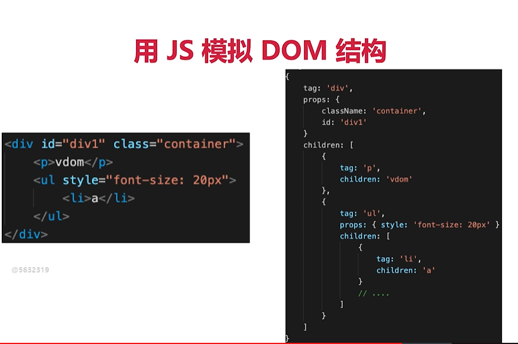

### 为什么考察原理？

- 之前然知其所以然——各行业通用的道理
- 了解原理，才能应用的更好（竞争激烈，择优录取)
- 大厂造轮子（有钱有资源，业务定制，技术KPI)

### 如何去考察原理？以何种方式考察？

考察重点，而不是考察细节。掌握好2/8原则
和使用相关的原理，例如 vdom, 模板渲染等
整体流程是否全面？（闭环）热门技术是否有深度？

### vue 原理包含哪些？

组件化
响应式
vdom(virtual DOM) 和 diff
模板编译
渲染过程
前端路由

### 组件化 和 MVVM

#### 组件化基础
从组件化 => MVVM

组件化概念很早就有了, asp jsp php 已经有组件化
nodejs中也存在 组件化 web1.0 web2.0 后端渲染已经有组件化概念
传统组件和现在的VUE　REACT　组件渲染

#####　数据驱动视图（MVVM，setState）

传统组件，只是静态渲染，更新还要依赖于DOM操作 Jquery 那个时候比较流行
数据驱动视图　——　Vue MVVM
数据驱动视图 —— React setState
不再关注DOM操作，数据更改，动态渲染视图，关注业务需求，编写逻辑，降低复杂度。

##### Vue MVVM(回答：从组件化，数据驱动视图，再讲到 MVVM)

#### 组件的响应式

#### vue 响应式
* 组件data 的数据一旦变化，立刻触发视图的更新
* 实现数据驱动视图第一步
* 考察Vue 原理的第一题

#### 介绍Vue响应式
核心API-Objec.defineProperty
如何实现响应式，代码演示
Object.defineProperty的一些缺点（Vue3.0 启用Proxy）

Proxy 有兼容性问题:Proxy兼容性不好，且无法 ployfill

(缺)

#### 虚拟DOM（virtual DOM） 和 diff算法
Vdom 时实现 vue 和 React 的重要基础
diff 算法是 vdom 中最核心，最关键的部分
热门考题

### 详细
DOM操作非常耗费性能，速度慢
在使用 JQuery 时候，我们可以自己控制DOM 的时机，手动调整
在Vue 和 React 是数据驱动视图，如何有效控制DOM？
技术复杂度降低，业务复杂度提高，视图操作同样消耗性能
Vue和 React 通过 vdom 控制 dom操作

存在一定的复杂度，减少操作DOM计算次数比较困难
能不能把计算，更多的转换为JS计算？ JS执行速度很快
vdom 本质 用 JS 模拟 DOM结构，计算出最小的变更，操作DOM

#### JS如何模拟 DOM 结构

#### 问题：提供一段html  ，用js 模拟DOM 

1.标签tag

2.属性props

3.子元素children

#### 通过 snabbdom 学习 vdom
简洁强大的vdom库
VUE参考它实现 vdom 和 diff

https://github.com/snabbdom/snabbdom

给操作DOM 带来哪些价值和有点

Vue3.0 重写 vdom 的代码，优化了性能，但vdom的基本理念不变，面试考点也不变

React vdom 具体实现和Vue也不同。

#### 问题：请用 vnode 模拟以下片段

#### snabbdom 重点总结

h函数： 怎么生成vnode 结构

vnode 数据结构：vnode结构具体是什么？

patch 函数功能：初次渲染，dom 更新， 

#### vdom 总结

用JS模拟DOM结构（vnode）

新旧vnode对比，得出最小的更新范围，最后更新DOM

数据驱动视图模式下，有效控制 DOM 操作

> 面试： vnode是什么？vdom怎么操作的？  vdom 意义是什么？

#### diff算法？

> diff算法是vdom的核心，是新旧vnode 对比过程
>
> diff算法在日常使用vue React 中如何体现的？（例如key）
>
> diff算法是前端面试时的热点话题。

概述：

diff 即对比，是一个广泛的概念，不仅仅应用在vdom 中，如 Linux diff 命令对比两个文件不同，git diff 比较文件之间不同

两个js对象也可以做diff ,如https://github.com/cujojs/jiff

两颗树做 diff, 如这里的vdom diff

#### 树 diff 的时间复杂度O（n^3）

第一： 遍历 tree1; 第二，遍历 tree2, 第三，排序。假设1000个节点，就要计算1000^3 算法不可用的

#### 优化时间复杂度O(n)

只比较同一层级，不跨级比较

tag 不相同，则直接删掉重建，不再深度比较

tag 和 key ,两者都相同，则认为是相同节点，不再深度比较

