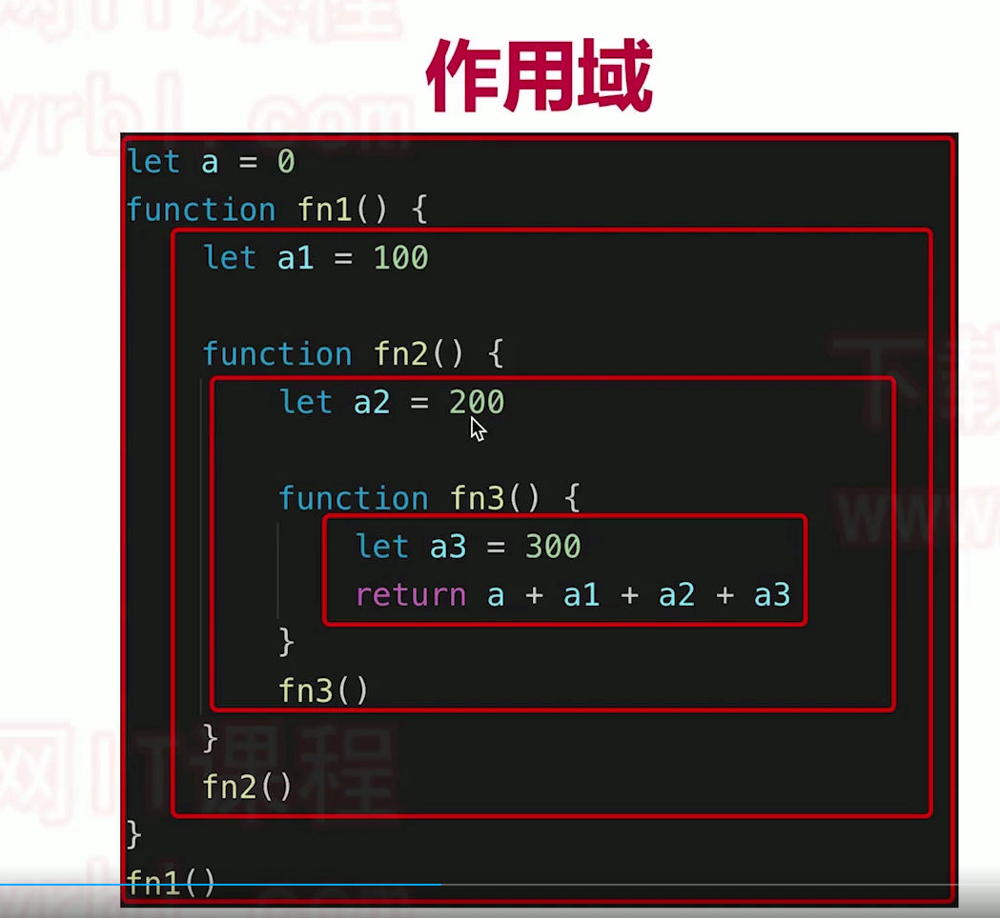

### 什么是作用域？
作用域可以理解为：变量的合理作用范围
《你不知道的javascript》 对作用域的定义——作用域是根据名称查找变量的一套规则

#### 查找规则
在当前作用域中无法找到某个变量时，引擎就会在外层嵌套的作用域中继续查找，直到找到该变量，或抵达最外层的作用域（也就是全局作用域）为止。

### 作用域分为： 全局作用域， 函数作用域， 块级作用域

### 自由变量

* 一个变量在当前作用域没有定义，但是被使用
* 向上级作用域，一层一层依次寻找，直到找到为止
* 如果到全局作用域都没找到，则报错 xx is not defined