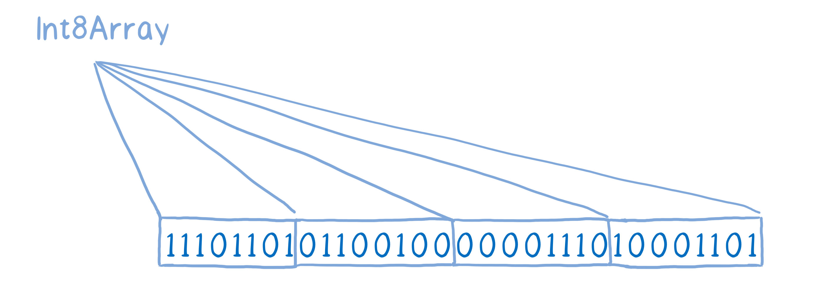
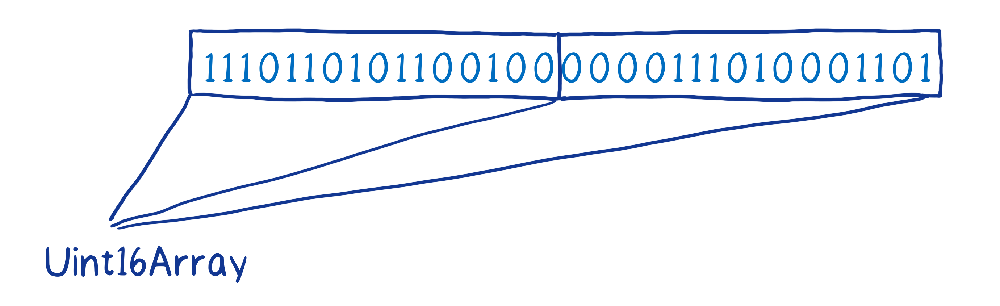

# Buffer 


## 背景知识

1. ArrayBuffer 
[MDN详解](https://developer.mozilla.org/zh-CN/docs/Web/JavaScript/Reference/Global_Objects/ArrayBuffer)

通用的、固定长度的原始二进制数据缓冲区

  1.1 ArrayBuffer能够直接操作吗？

  答： 不能直接操作。通过 类型数组对象来操作（TypedArray）, 将缓冲区中的数据表示为特定的格式

  可以把 arrayBuffer理解为一块内存，具体存什么需要其他声明

```js
const buffer = new ArrayBuffer(8)
console.log(buffer)

// 打印结果
ArrayBuffer {
  [Uint8Contents]: <00 00 00 00 00 00 00 00>,
  byteLength: 8
}
const typedArray = new Int16Array(buffer)
console.log(typedArray)
// 打印结果
Int16Array(4) [ 0, 0, 0, 0 ] 可以看做四位的数组
```

2. Unit8Array

   表示一个8位的无符号整形数组，创建的时候内容被初始化为0

   1 字节byte = 8 位bit

   js Number = 64 位 = 8字节byte

```js
const unit8 = new Uint8Array(2) // 传入 nunber
unit8[0] = 42
console.log(unit8)  // Uint8Array(2) [ 42, 0 ]
console.log(unit8[0]) // 42
console.log(unit8.BYTES_PER_ELEMENT) // 每一个元素所占的字节数 1

const arr = new Uint8Array([21, 31]) // 传入数组
console.log(arr)  // Uint8Array(2)[21, 31]
// 与数组相比，多了内存的属性
```


3.  ArrayBuffer 和 TypedArray的关系是什么？

TypedArray: Uint8Array , Int16Array， Int32Array ，都是给 ArrayBuffer 提供了了⼀个 “View”，MDN上的原话叫做 “Multiple views on the same data”（同一个数据的多个视图），对它们进行下标读写，最终都会反应到它所建立在的 ArrayBuffer之上。

ArrayBuffer: 本身是一个0 和1 存放在一行里面的一个集合，，ArrayBuffer 不不知道第一个和第二个元素在数组中该如何分配。


3.1 例如，你可以使用一个 Int8 的确定类型数组来分离存放 8 位二进制字节。以8位进行划分

3.2 例如，你可以使用一个无符号的 Int16 数组来分离存放 16 位二进制字节。以16位进行划分


4. 总结

   ArrayBuffer 扮演了原生内存的角色


## NodeJS Buffer

Buffer 类以一种更优化、更适合 Node.js 用例的方式实现了 Uint8Array API.

**Buffer 类的实例类似于整数数组**，但 Buffer 的大小是**固定**的、且在 V8 堆外分配物理内存。 **Buffer 的大小在被创建时确定，且无法调整**。


### 基本使用

```js
// 创建一个长度为 10、且用 0 填充的 Buffer。
const buf1 = Buffer.alloc(10); // <Buffer 00 00 00 00 00 00 00 00 00 00>


// 创建一个长度为 10、且用 0x1 填充的 Buffer。 
const buf2 = Buffer.alloc(10, 1); // <Buffer 01 01 01 01 01 01 01 01 01 01>

// 创建一个长度为 10、且未初始化的 Buffer。
// 这个方法比调用 Buffer.alloc() 更快，
// 但返回的 Buffer 实例可能包含旧数据，
// 因此需要使用 fill() 或 write() 重写。
const buf3 = Buffer.allocUnsafe(10); //<Buffer 18 46 66 e6 24 02 00 00 78 8a>

// 创建一个包含 [0x1, 0x2, 0x3] 的 Buffer。
const buf4 = Buffer.from([1, 2, 3]);

// 创建一个包含 UTF-8 字节  的 Buffer。
const buf5 = Buffer.from('tést');

```
#### tips

1. 当调用 Buffer.allocUnsafe() 时，被分配的内存段是未初始化的（没有用 0 填充）。 

虽然这样的设计使得内存的分配非常快，但已分配的内存段可能包含潜在的敏感旧数据。 使用通过 Buffer.allocUnsafe() 创建的没有被完全重写内存的 Buffer ，在 Buffer内存可读的情况下，可能泄露它的旧数据。
虽然使用 Buffer.allocUnsafe() 有明显的性能优势，但必须额外小心，以避免给应用程序引入安全漏洞。

Buffer 实例一般用于表示编码字符的序列，比如 UTF-8 、 UCS2 、 Base64 、或十六进制编码的数据。 通过使用显式的字符编码，就可以在 Buffer 实例与普通的 JavaScript 字符串之间进行相互转换。

```js
const buf = Buffer.from('hello world', 'ascii');

console.log(buf)

// 输出 aGVsbG8gd29ybGQ=
console.log(buf.toString('base64'));
```
Node.js 目前支持的常见的字符编码包括：

1. 'ascii' - 仅支持 7 位 ASCII 数据。

2. 'utf8' - 多字节编码的 Unicode 字符。许多网页（HTML）和其他文档格式都使用 UTF-8 。

3. 'base64' - Base64 编码。当从字符串创建 Buffer 时，按照 RFC4648 第 5 章的规定，这种编码也将正确地接受 “URL 与文件名安全字母表” 以映射方式。