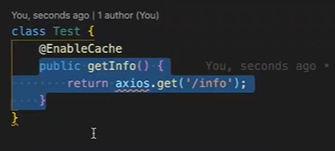

## 面试题及实战

1. 你觉得使用ts的好处是什么？

1.1 TypeSCript 是 Javascript 的超集（加强版），给js添加了可选的静态类和基于类的面向对象编程，拓展了js的语法

  1.2 ts 面向对象编程的语言，包含类和接口的概念

  1.3 ts 在开发阶段就能给出编译错误

  1.4 ts 是一种强类型语言，你可以明确知道数据的类型，代码可读性极强

  1.5 ts 中有很多方便的特性，例如： 可选链。 // optional chain

  ```ts
  const obj = response;

  if(obj&&obj.aa&&obj.aa.bb) {
    const value = obj.aa.bb
  }


  // 可选链
  if(obj?.aa?.bb?) {
    const value = obj.aa.bb;
  }

  ```


2. type 和 interface 的异同？

  用 interface来描述数据结构， 用type来描述类型

    2.1 都可以描述⼀一个对象或者函数

  ```ts
  interface User {
    name: string;
    age: number
  }

  interface SetUser {
    (name:string, age: number) : void;
  }


  type User = {
    name: string;
    age: number;
  }

  type SetUser = (name: string, age: number) => void;
  ```
    2.2 都允许拓展（extends）
      interface 和 type 都可以拓展，并且两者不是相互独立的，也就是说 interface 可以 extends
      type, type 也可以 extends interface 。 虽然效果差不不多，但是两者语法不不同。
    
      ```ts
      // interface extends interface 
      interface Name {
        name: string;
      }
      interface User extends Name {
        age: number;
      }


      // type extends type
      type Name = {
        name: string;
      }
      type User = Name & { age: number };


      // interface extends type
      type Name = {
        name: string;
      }
      interface User extends Name {
        age: number;
      }
      // type extends interface
      interface Name {
        name: string;
      }
      type User = Name & {
        age: number;
      }
      ```

2.3 只有type可以做的
Type 可以声明基本类型别名，联合类型，元组等类型

```ts
// 基本类型别名
type Name = string
// 联合类型
interface Dog {
  wong();
}
interface Cat {
  miao();
}
type Pet = Dog | Cat


// 元组 定义数组每个位置的类型
type PetList = [Dog, Pet]

// 当你想获取⼀一个变量量的类型时，使⽤用 typeof
let div = document.createElement('div');
type B = typeof div
```
3.如何基于⼀一个已有类型, 扩展出⼀一个⼤大部分内容相似, 但是有部分区别的类型?
  首先可以通过Pick和Omit(省略)

  ```ts
  interface Test {
    name: string;
    sex: number;
    height: string;
  }
  type Sex = Pick<Test, 'sex'>;
  const a: Sex = { sex: 1 };
  type WithoutSex = Omit<Test, 'sex'>;
  const b: WithoutSex = { name: '1111', height: 'sss' };
  ```
  比如Partial, Required.
  或者通过泛型

  4. 什么是泛型, 泛型的具体使⽤用?
泛型是指在定义函数、接⼝口或类的时候，不不预先指定具体的类型，使⽤用时再去指定类型的⼀一种特性。
可以把泛型理理解为代表类型的参数

```ts
interface Test<T = any> {
  userId: T
}

type TestA = Test<string>
// { userId: string }
type TestA = Test<number>
// { userId: number }

const a: TestA = {
  userId: '111',
};
const b: TestB = {
  userId: 2222,
};
```

5. 用装饰器实现一个计算函数运行时间的逻辑

```ts 
// 装饰器

export function decorator (target: any, name: string, descriptor: PropertyDescriptor) {
  const val = descriptor.value;

  descriptor.value = async function() {
    // TODO 
  }

  return descriptor;
}

```

6. 缓存装饰器

一个 http 请求， a 页面用到了， b 页面也会用到，当不使用 vuex redux 状态管理工具时

可以实现一个缓存装饰器进行管理, 缓存一个 promise 



存在缓存中，强制刷新就消失

不要滥用缓存装饰器，确保当前请求不会频繁改变，使用

 7. 实现一个路由跳转，通过ts约束参数的 routeHelper. (1小时24分)

    路由跳转时传入参数的约束

    

8. 实现一个基本ts 和事件模式的 countdown 基础类

   ​    倒计时基础类

  ```ts
  // countdown.ts
  import {EventEmitter} from 'eventemitter3'

  export interface RemainTimeData {
    days: number;
    hours: number;
    minutes: number;
    seconds: number;
    count: number;
  }

  enum CountdownStatus {
    running,
    paused,
    stoped,
  }
  export enum CountdownEventName {
    START = 'start',
    STOP = 'stop',
    RUNNING = 'running'
  }

  // 固定格式 eventEmitter 
  interface CountdownEventMap {
    [CountdownEventName.START]: [];
    [CountdownEventName.STOP]: [];
    [CountdownEventName.RUNNING]: [RemainTimeData]
  }

  export class Countdown extends EventEmitter<> {
    private endTime: number;
    private step: number;

    constructor (endTime: number, step: number = 1e3) {
      super()
      this.endTime = endTime
      this.step = step
    }

    public start() {
      
    }

    public stop() {

    }

    private countdown() {

    }
  } 
  ```

  9. eventemitter3 
  
  是同步的还是异步的

  on / emit

  类似 手写 eventbus 同步  遍历回调，调用回调函数执行
  class {
    emit
    on
    once
    remove
  }