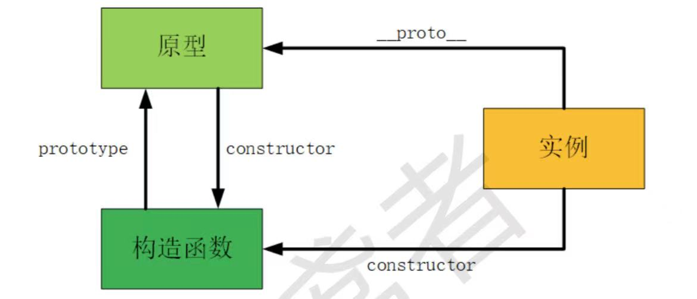
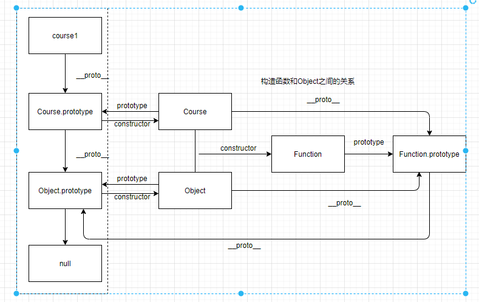
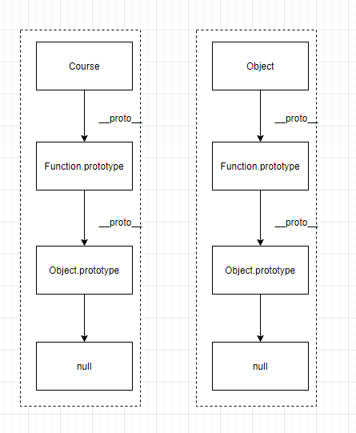

## 对象是什么？ 为什么要面向对象？

特点：面向对象（OOP）：逻辑迁移灵活、代码可复用性高、高度模块化

---

#### 对象的理解

-   对象是对于单个物体的简单抽象
-   对象是一个容器、封装了属性&方法
    *   属性：对象的状态
    *   方法：对象的行为

```js
// 简单对象
const Course = {
    teacher: '云隐',
    leader: '黄小杨',
    startCourse: function (name) {
        return `开始${name}课`
    },
}
// 函数对象
function Course() {
    this.teacher = '云隐'
    this.leader = '黄小杨'
    this.startCourse = function (name) {
        return `开始${name}课`
    }
}
```

---

## 构造函数 - 生成对象 constructor

#### 需要一个模板 - 表征一类的共同特征，从而生成对象

#### 类即是对象模板

#### js 其实本质不是基于类 而是基于构造函数+原型链

#### constructor + prototype

```js
function Course() {
    this.teacher = '云隐'
    this.leader = '黄小杨'
}

// 实例化
const course = new Course()
```

#### Course 本质上是构造函数

-   1. 函数体内是用的 this， 代表所要生成的实例对象
-   2. 生成对象通过 new 进行实例化
-   3. 可以做初始化传参

#### 追问： 构造函数， 不初始化， 可以用吗？ / 不能使用 undefined

#### 如果需要使用，如何做兼容？ 在内部生成实例

```js
function Course() {
    const _isClass = this instanceof Course
    if (!_isclass) {
        return new Course()
    }
    this.teacher = '云隐'
    this.leader = '黄小杨'
}
const course = Course()
```

---

#### 引发思考： new 是什么/ new 原理 /new 做了什么

```js
function Course() {}
const course = new Course()
```

-   1. 创建了一个空对象，作为返回的对象实例
-   2. 将生成空对象的原型对象指向了构造函数的 prototype 属性
-   3. 将当前实例对象赋给了内部 this
-   4. 执行构造函数初始化代码

### 追问 ：实例属性影响

```js
function Course(teacher, leader) {
    this.teacher = teacher
    this.leader = leader
}

const course1 = new Course('云隐', '黄小杨')
const course2 = new Course('云隐', '黄小杨')
course2.leader = '可可'
// 生成的实例之间属性是隔离的
```

## constructor 是什么？

```js
function Course(teacher, leader) {
    this.teacher = teacher
    this.leader = leader
}

const course = new Course('云隐', '黄小杨')

course.constructor = Course // true
Course.prototype
```

-   1. 每个对象创建时会自动拥有一个构造函数属性 constructor
-   2. constructor 继承自原型对象，指向构造函数的引用
 

#### 追问： 使用构造函数 存在什么问题？ /会有什么性能问题？

```js
function Course(name) {
    this.teacher = '云隐'
    this.leader = '黄小杨'
    this.startCourse = function (name) {
        return `开始${name}课`
    }
}

const course1 = new Course('es6')
const course2 = new Course('OOP')
```

构造函数中的方法，会存在于每个生成的实例中
重复挂载会导致资源浪费

---

## 原型对象

```js
function Course() {}
const course1 = new Course()
const course2 = new Course()
```

-   1. 构造函数： 用来初始化创建对象的函数 -Course
        - 自动给构造函数赋予一个属性 prototype，该属性实际等于实例对象的原型对象`course.__proto__ === Course.prototype`

*   2. 实例对象： course1 就是实例对象，根据原型创建出来的实例
        - 每个实例对象都有个`__proto__` ——隐式原型
        - 每个实例对象都有个 constructor 属性 
        - constructor 由继承而来，并指向当前构造函数

*   3. 原型对象 Course.prototype

---

```js
function Course() {}
Course.prototype.teacher = '云隐'
const course1 = new Course()
const course2 = new Course()

// 对上篇原型对象做优化
function Course(name) {
    this.teacher = '云隐'
    this.leader = '黄小杨'
    // this.startCourse = function (name) {
    //     return `开始${name}课`;
    // };
}
// 在原型上挂载属性和方法，实例可以共享原型上的方法和属性
Course.prototype.startCourse = function (name) {
    return `开始${name}课`
}

const course1 = new Course('es6')
const course2 = new Course('OOP')
```

## 构造函数， 原型函数，实例函数



## 构造函数， Object 原型上的关系



## 继承

#### 在原型对象的所有属性和方法，都能被实例所共享

```js
// Game类
function Game() {
    this.name = 'lol'
}
Game.prototype.getName = function () {
    return this.name
}

function LOL() {}
// LOL 类
// LOL 继承Game类
LOL.prototype = new Game()
LOL.prototype.constructor = LOL

const game = new LOL()
// 本质：重写原型对象，将父对象的属性方法，作为子对象原型对象的属性和方法
```

#### 追问： 原型链继承有什么缺点

```js
// Game类
function Game() {
    this.name = 'lol'
    this.skin = ['s']
}
Game.prototype.getName = function () {
    return this.name
}

function LOL() {}
// LOL 类
// LOL 继承Game类
LOL.prototype = new Game()
LOL.prototype.constructor = LOL

const game1 = new LOL()
const game2 = new LOL()
game1.skin.push('sss')
```

-   1. 父类属性一旦赋值给子类的原型属性，此时属性属于子类的共享属性
-   2. 实例化子类时，不能向父类传参

### 解决方案

#### 经典继承： 在子类构造函数内部调用父类构造函数

```js
// Game类
function Game(arg) {
    this.name = 'lol'
    this.skin = ['s']
}
Game.prototype.getName = function () {
    return this.name
}
// LOL 类
function LOL(arg) {
    // 子类函数内部调用父类函数
    Game.call(this, arg)
}
// LOL 继承Game类

const game3 = new LOL()
// 解决共享属性问题和传参问题
```

### 追问：原型链上的共享方法无法被读取继承，如何解决？

#### 解决方案：组合继承

```js
// Game类
function Game(arg) {
    this.name = 'lol'
    this.skin = ['s']
}
Game.prototype.getName = function () {
    return this.name
}
// LOL 类
function LOL(arg) {
    // 子类函数内部调用父类函数
    Game.call(this, arg)
}
// LOL 继承Game类
LOL.prototype = new Game()
LOL.prototype.constructor = LOL

const game4 = new LOL()
```

### 追问组合继承就没有缺点吗？ 问题就在于：无论何种场景都会调用两次父类构造函数

-   1. 初始化子类原型时
-   2. 子类构造函数内部 Call 父类的时候

### 解决方案： 寄生组合继承

`Object.create()方法创建一个新对象，使用现有的对象来提供新创建的对象的__proto__`

```js
// Game类
function Game(arg) {
    this.name = 'lol'
    this.skin = ['s']
}
Game.prototype.getName = function () {
    return this.name
}
// LOL 类
function LOL(arg) {
    // 子类函数内部调用父类函数
    Game.call(this, arg)
}
// LOL 继承Game类
LOL.prototype = Object.create(Game.prototype)
LOL.prototype.constructor = LOL

const game4 = new LOL()
```

#### 提高：看起来完美解决了继承。js 如何实现多重继承？

JS 本身是不支持多重继承

`Object.assign() 方法用于将所有可枚举属性的值从一个或多个源对象分配到目标对象。它将返回目标对象。`

```js
// Game类
function Game(arg) {
    this.name = 'lol'
    this.skin = ['s']
}
Game.prototype.getName = function () {
    return this.name
}

// Store 类
function Store() {
    this.shop = 'steam'
}
Store.prototype.getPlatform = function () {
    return this.shop
}
// LOL 类
function LOL(arg) {
    // 子类函数内部调用父类函数
    Game.call(this, arg)
    Store.call(this.arg)
}
// LOL 继承Game类
// LOL.prototype = Object.create(Game.prototype);
LOL.prototype = Object.assign(Game.prototype, Store.prototype)
LOL.prototype.constructor = LOL

const game4 = new LOL()
```
